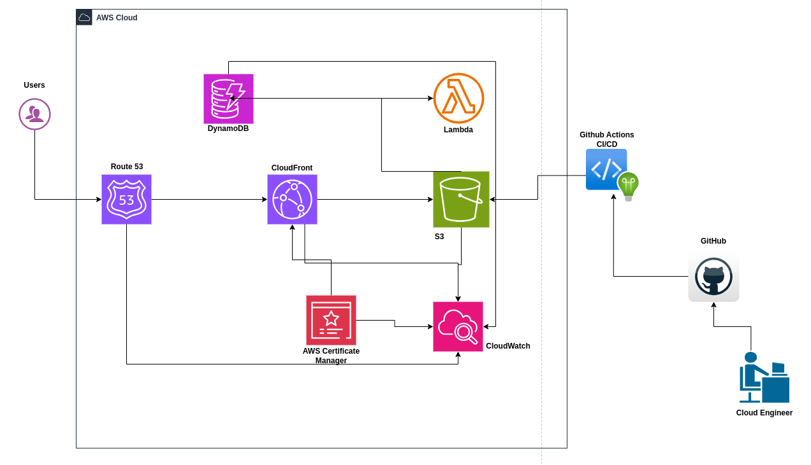

# 🌐 Static Portfolio Website on AWS

This project hosts my personal portfolio website using AWS S3, CloudFront, Route 53, SSL via ACM, and GitHub Actions for CI/CD.

🔗 **Live Site**: [https://urigakuru.uriroots.com](https://urigakuru.uriroots.com)

---

## 🚀 Features

- Static site hosted on S3
- Fast global delivery via CloudFront
- Custom domain with Route 53
- Free SSL certificate with AWS ACM
- Automated deployment using GitHub Actions

---

## 📐 Architecture



---

## 📁 Project Structure

portfolio/ ├── .github/workflows/ │ └── cicd.yml # GitHub Actions for CI/CD ├── index.html ├── css/ ├── js/ ├── images/ └── README.md


---

## 🔧 Deployment Steps

1. **Set up S3 bucket**
   - Enable static website hosting
   - Set permissions for public access

2. **Configure Route 53**
   - Register domain or set up DNS records
   - Add A record (alias to CloudFront)

3. **Provision ACM SSL**
   - Request certificate for domain
   - Validate via Route 53 DNS

4. **Create CloudFront Distribution**
   - Origin: S3 bucket endpoint (not website URL)
   - SSL: Use ACM certificate
   - Set default root object

5. **Set up GitHub Actions**
   - Use `aws-actions/configure-aws-credentials`
   - Deploy on push to `main`

---

## 🧪 CI/CD Workflow Example

```yaml
name: Deploy to S3

on:
  push:
    branches:
      - main

jobs:
  deploy:
    runs-on: ubuntu-latest
    steps:
      - name: Checkout Code
        uses: actions/checkout@v3

      - name: Configure AWS Credentials
        uses: aws-actions/configure-aws-credentials@v3
        with:
          aws-access-key-id: ${{ secrets.AWS_ACCESS_KEY_ID }}
          aws-secret-access-key: ${{ secrets.AWS_SECRET_ACCESS_KEY }}
          aws-region: us-east-1

      - name: Deploy to S3
        run: aws s3 sync ./site s3://urigakuru.uriroots.com --delete


🛠️ Lessons Learned
YAML indentation matters!

Always validate GitHub Actions syntax locally

Use architecture diagrams to plan before building

AWS Free Tier is a great resource